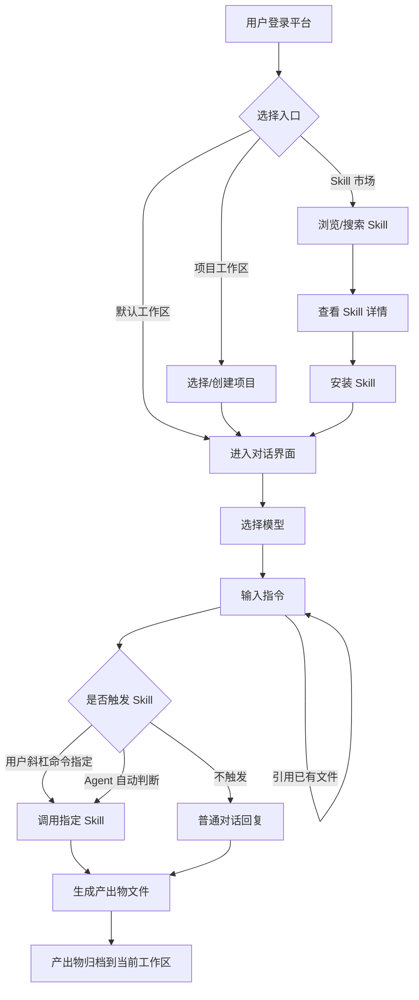
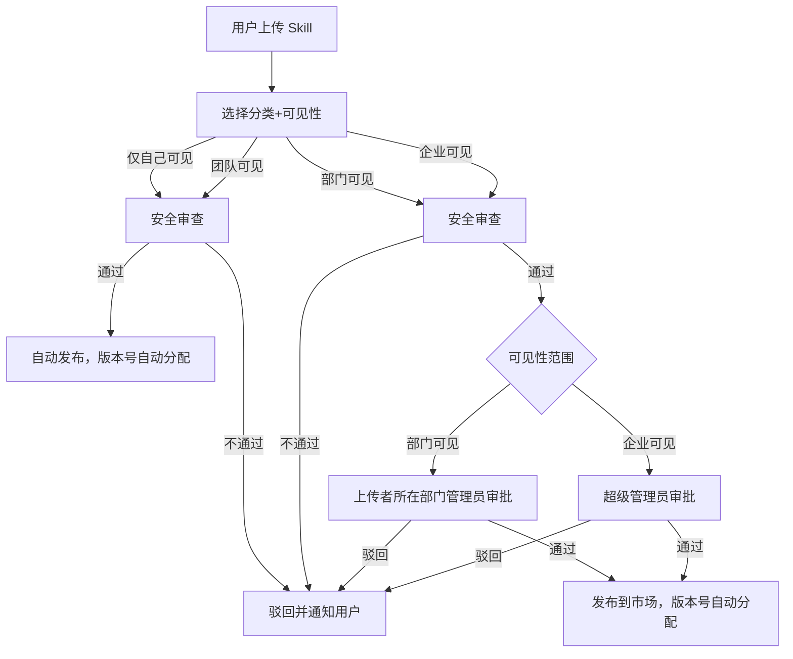
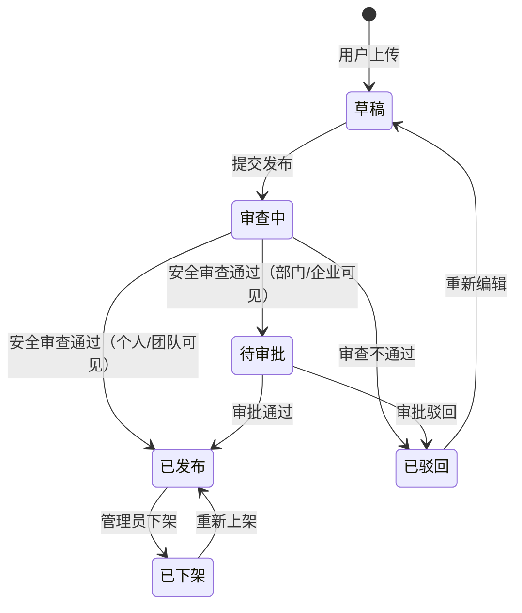
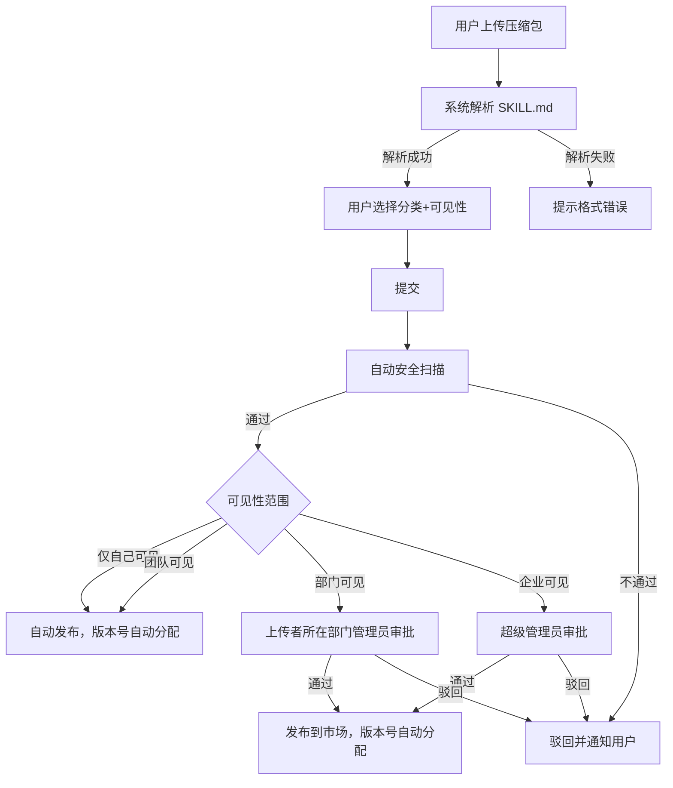

# Shokz Agents 中台 产品需求文档（PRD）

版本号：V1.0.0

| 版本   | 时间       | 修订人 | 备注             |
|--------|-----------|--------|-----------------|
| V1.0.0 | 2026/06/24 | -    | 创建 V1.0.0 版本 |

---

## 一、概述

### 1.1 产品概述及目标

#### 1.1.1 背景介绍

当前各部门已在使用各类 AI 工具（Claude Code、Cursor、GPT 等）完成业务任务，但存在以下核心问题：

1. **能力零散不可复用**：各部门独立积累的 AI 能力（包括但不限于 Prompt、Skill 文件、MCP 配置、业务 SOP、工具调用链路等）分散在个人工具中，无法被发现和共享，导致大量重复造轮子
2. **人员离职能力流失**：AI 经验和方法论绑定在个人身上，人走能力即消失，企业无法沉淀
3. **缺乏协同机制**：跨部门的复杂业务场景需要多种 AI 能力配合，目前没有统一的协作框架

#### 1.1.2 产品概述

**V1 定位**：企业级 Skill 能力沉淀、发现、安装与调用平台。以对话为核心交互形式，让员工快速找到并使用企业内已有的 AI 能力完成业务任务。

**长期愿景**：演进为支持 MCP、知识库、Agent、多 Agent 协作的企业级 AI 中台，实现跨部门数字员工协同。

#### 1.1.3 产品目标

| 目标 | 指标 | 口径说明 | 目标值 | 达成时间 |
|------|------|---------|--------|---------|
| 用户覆盖率 | 平台使用人数 / 企业总人数 | 统计周期内至少登录 1 次的去重用户 | 待定 | 上线后 3 个月 |
| 效率提升 | 标杆场景任务完成时长下降比例 | 选取 2-3 个标杆场景，对比使用前后平均耗时 | 待定 | 上线后 3 个月 |
| Skill 供给量 | 平台已上架 Skill 数量 | 状态为"已发布"的 Skill 总数 | 待定 | 上线后 3 个月 |

#### 1.1.4 目标用户

| 角色 | 描述 | 核心诉求 |
|------|------|---------|
| 业务方员工 | 各部门使用 AI 提效的普通员工 | 发现和使用 skills 完成业务任务 |
| 管理员 | 部门级管理者 | 管理本部门 skill 的审批与可见性 |
| 超级管理员 | 平台运营者 | 全局 skill 管理、企业级 skill 创建与发布、冷启动 |

### 1.2 角色及权限

| 角色 | 权限范围 | 数据范围 |
|------|---------|---------|
| 超级管理员 | 全部功能：创建企业级 Skill、审批管理、Skill 上下架/编辑分类、用户管理、分类管理 | 全部数据 |
| 部门管理员 | 管理后台：审批本部门 Skill、管理本部门 Skill（上下架/编辑分类）；用户侧功能同普通用户 | 本部门数据（含部门内个人创建的 Skill） |
| 普通用户 | 浏览市场、安装 Skill、对话、创建项目、上传 Skill、上传文件、创建团队（需超管审批）/管理团队 | 个人数据 + 所属团队数据 + 已安装的 Skill |

---

## 二、产品描述

### 2.1 产品版本规划

| 版本 | 范围 | 计划时间 | 状态 |
|------|------|---------|------|
| V1.0 | Skill 市场、对话、项目、产出物、管理后台（审批+企业级Skill） | 2026/07/22 | 进行中 |
| V2.0 | Agents 市场、MCP 市场 | 待定 | 规划中 |
| V3.0 | 协作空间（多 Agent + 多人员）、知识库 | 待定 | 远期 |

### 2.2 功能清单

| 模块 | 功能 | 优先级 | 版本 | 说明 |
|------|------|--------|------|------|
| 工作区（对话） | 新建对话 | P0 | V1.0 | 在默认工作区或项目工作区中创建新对话 |
| 工作区（对话） | 多模型切换 | P0 | V1.0 | 支持在对话中选择/切换 LLM 模型 |
| 工作区（对话） | 流式输出 | P0 | V1.0 | Agent 回复实时流式展示 |
| 工作区（对话） | 斜杠命令调用 Skill | P0 | V1.0 | 用户通过 "/" 命令主动指定 Skill |
| 工作区（对话） | Agent 自动调用 Skill | P0 | V1.0 | Agent 根据上下文自动判断调用已安装 Skill |
| 工作区（对话） | 对话历史 | P0 | V1.0 | 查看历史对话列表，可继续对话 |
| 工作区（对话） | @引用文件继续对话 | P1 | V1.0 | 用户在输入框通过 @ 引用当前工作区文件（产出物+上传文件）作为上下文继续提问 |
| 工作区（对话） | Skill 执行过程展示 | P1 | V1.0 | 展示 Skill 执行步骤与中间状态 |
| 工作区（产出物） | 产出物生成 | P0 | V1.0 | 对话产出以独立文件形式保存到当前工作区 |
| 工作区（产出物） | 产出物列表与预览 | P0 | V1.0 | 右侧面板上方展示当前工作区产出物，支持预览 |
| 工作区（产出物） | 产出物下载 | P0 | V1.0 | hover 列表项显示下载图标 |
| 工作区（文件上传） | 输入框附件上传 | P0 | V1.0 | 输入框附件图标上传文件，自动作为当前消息上下文并保存到上传文件列表 |
| 工作区（文件上传） | 侧边栏上传 | P0 | V1.0 | 右侧边栏「上传文件」区域上传按钮，纯保存到工作区 |
| 工作区（文件上传） | 上传文件列表与预览 | P0 | V1.0 | 右侧面板下方展示用户上传的文件，支持预览 |
| 项目 | 创建/管理项目 | P0 | V1.0 | 创建项目工作区，管理基本信息 |
| 项目 | 项目切换 | P0 | V1.0 | 左侧导航切换不同项目工作区 |
| Skill 市场 | 浏览/搜索 | P0 | V1.0 | 按分类、关键词发现 Skill |
| Skill 市场 | Skill 详情页 | P0 | V1.0 | 展示 Skill 描述、使用说明、安装量等 |
| Skill 市场 | 安装/卸载 | P0 | V1.0 | 一键安装，全局生效（所有工作区可用） |
| Skill 管理 | 上传 Skill | P0 | V1.0 | 用户上传 Skill 文件，填写信息 |
| Skill 管理 | 选择可见性 | P0 | V1.0 | 个人/团队/部门/企业四级可见性 |
| Skill 管理 | 团队管理 | P0 | V1.0 | 用户可创建团队、选择成员、编辑成员、解散团队，入口在上传选团队时 |
| Skill 管理 | 我的 Skill | P1 | V1.0 | 查看自己上传和安装的 Skill |
| 管理后台 | 企业级 Skill 创建 | P0 | V1.0 | 超级管理员创建并发布企业级 Skill |
| 管理后台 | Skill 审批 | P0 | V1.0 | 审核用户提交的部门可见/企业可见 Skill |
| 管理后台 | Skill 上下架 | P1 | V1.0 | 管理已发布 Skill 的状态 |
| 管理后台 | 团队审批 | P0 | V1.0 | 超级管理员审批用户创建的团队申请 |

### 2.3 产品框架

**产品模块关系图**

```
┌─────────────────────────────────────────────────────────────────────────┐
│                          用户侧                                          │
│                                                                         │
│  ┌──────────────────────────────────────────────────────────────────┐  │
│  │                  工作区（对话 + 产出物 + 上传文件）                   │  │
│  │                                                                    │  │
│  │   用户输入 ──→ Agent ──→ 调用 Skill ──→ 生成产出物                  │  │
│  │       │          │                          │                      │  │
│  │       │          ▼                          ▼                      │  │
│  │       │    多模型切换               归档到项目/默认工作区             │  │
│  │       │                                                            │  │
│  │       └──→ @引用已有文件（产出物/上传文件）                            │  │
│  └──────────────────────────────────────────────────────────────────┘  │
│         ▲                          ▲                                    │
│         │ 调用                      │ 安装                              │
│         │                          │                                    │
│  ┌──────┴──────┐            ┌──────┴──────┐                            │
│  │  已安装的    │            │  Skill 市场  │◀── 发布 ──┐                │
│  │  Skill 列表  │◀── 安装 ──│  浏览/搜索   │           │                │
│  └─────────────┘            └─────────────┘           │                │
│                                    ▲                   │                │
│                                    │ 上传              │                │
│                              ┌─────┴─────┐            │                │
│                              │  用户上传   │            │                │
│                              │  Skill     │            │                │
│                              └─────┬─────┘            │                │
└────────────────────────────────────┼──────────────────┼────────────────┘
                                     │                  │
                                     ▼                  │
┌────────────────────────────────────────────────────────────────────────┐
│                          管理侧                                         │
│                                                                        │
│  ┌────────────┐     ┌────────────┐     ┌────────────┐                │
│  │  安全审查   │────▶│  审批流     │────▶│  发布到市场  │────────────────┘
│  │ (自动扫描)  │     │(通过/驳回)  │     │(版本号自动) │                │
│  └────────────┘     └────────────┘     └────────────┘                │
│                                                                        │
│  ┌────────────┐     ┌────────────┐     ┌────────────┐                │
│  │ Skill 管理  │     │  用户管理   │     │  分类管理   │                │
│  │(上下架/编辑)│     │  角色分配   │     │ (增删改排序)│                │
│  └────────────┘     └────────────┘     └────────────┘                │
└────────────────────────────────────────────────────────────────────────┘
```

**用户侧概览**

```
┌────────────────────────────────────────────────────────────────────────────────────┐
│                              Shokz Agents 中台                              [📎]   │
├──────────────┬─────────────────────────┬──────────────────────┬────────────────────┤
│  左侧导航     │      中央对话区          │    右侧边栏（可展开/收起，点击 📎 切换）     │
│              │                         │  预览区域             │  文件列表区        │
│ 🔍 搜索      │ ┌─────────────────────┐ │ ┌────────────────┐  │  🔍 筛选...       │
│ 🧩 Skill 市场 │ │                     │ │ │                │  │  📄 竞品报告 ←选中 │
│              │ │  对话消息流           │ │ │  文件内容预览    │  │  📊 销售数据.csv  │
│ 项目    [+]  │ │  （流式输出）          │ │ │                │  │  🖼️ 流程图.png   │
│ ▾ 项目A      │ │  Skill 执行过程展示   │ │ │                │  │  📄 翻译结果.md   │
│   ├ 对话1    │ │                     │ │ │                │  │                  │
│   └ 对话2    │ │                     │ │ └────────────────┘  │                  │
│ ▸ 项目B      │ └─────────────────────┘ │                     │                  │
│              │                         │                     │                  │
│ 对话    [+]  │ ┌─────────────────────┐ │                     │                  │
│   排查xxx失败 │ │ 输入框               │ │                     │                  │
│   检查xxx权限 │ │ "/" + 模型 + 工作区   │ │                     │                  │
│   解析xxx逻辑 │ └─────────────────────┘ │                     │                  │
│              │                         │                     │                  │
│ ⚙️ 设置      │                         │                     │                  │
├──────────────┴─────────────────────────┴──────────────────────┴────────────────────┤

```

**管理后台概览**

```
┌──────────────────────────────────────────────────────────────────────────┐
│  Shokz Agents 管理后台                                                    │
├──────────────┬───────────────────────────────────────────────────────────┤
│  左侧菜单     │              内容区                                       │
│              │                                                           │
│ 📋 Skill 审批 │  ┌─────────────────────────────────────────────────────┐ │
│              │  │  表格列表 / 审批操作                                  │ │
│ 🧩 Skill 管理 │  │  （根据选中菜单切换）                                 │ │
│              │  └─────────────────────────────────────────────────────┘ │
│ 👥 团队审批   │                                                           │
│              │                                                           │
│ 👤 用户管理   │                                                           │
│              │                                                           │
│ 🏷️ 分类管理  │                                                           │
│              │                                                           │
└──────────────┴───────────────────────────────────────────────────────────┘
```

### 2.4 产品整体流程

#### 2.4.1 主流程

> **核心概念**：平台有两种工作区——"默认工作区"（即左侧导航的"对话"入口）和"项目工作区"。两者的对话交互、Skill 调用、产出物生成、文件上传逻辑完全一致，区别仅在于文件的归属隔离：默认工作区的文件堆在一起，项目工作区的文件按项目隔离管理。



#### 2.4.2 Skill 上传与发布流程



#### 2.4.3 Skill 状态转换图



### 2.5 全局说明

#### 2.5.1 全局异常处理

| 异常场景 | 处理方式 | 提示文案 |
|---------|---------|---------|
| 网络异常 | 显示提示，支持重试 | "网络连接异常，请检查后重试" |
| 模型调用超时 | 显示提示，支持重试/切换模型 | "模型响应超时，可重试或切换模型" |
| 模型调用失败 | 显示错误信息，支持重试 | "模型服务暂时不可用，请稍后重试" |
| Skill 调用失败 | 显示错误，标记失败的 Skill | "Skill [名称] 执行失败：[原因]" |
| 权限异常 | 显示提示，不允许操作 | "无操作权限，请联系管理员" |
| 文件生成失败 | 显示提示，支持重试 | "产出物生成失败，请重试" |

#### 2.5.2 全局交互

| 场景 | 交互方式 |
|------|---------|
| 操作成功 | Toast 提示，自动消失 |
| 操作失败 | 弹窗提示错误详情 |
| 对话加载中 | 流式输出 + 打字机效果 |
| Skill 执行中 | 显示执行步骤与进度 |
| 删除操作 | 二次确认弹窗 |
| 异步操作 | 按钮置灰防止重复提交 |
| 空状态 | 插画 + 引导文案 |

---

## 三、功能需求

### 3.1 工作区（对话）

#### 3.1.1 描述

工作区是用户与 Agent 交互的核心界面。平台有两种工作区：默认工作区（对话）和项目工作区（项目），两者使用交互完全一致。

#### 3.1.2 用户故事

```
作为业务方员工，我希望在对话中向 Agent 提问并获得回复，以便完成业务任务。
作为业务方员工，我希望通过 "/" 命令快速调用已安装的 Skill，以便精确控制 Agent 行为。
作为业务方员工，我希望切换不同的 LLM 模型，以便根据任务复杂度选择合适的模型。
作为业务方员工，我希望通过 @ 引用已有产出物继续对话，以便基于之前的成果进一步迭代。
```

#### 3.1.3 前置条件

| 类型 | 条件 |
|------|------|
| 权限依赖 | 用户已登录平台 |

#### 3.1.4 后置条件

- 对话记录持久化保存，可在左侧导航中查看历史
- 如 Agent 判定生成产出物，则产出物文件保存到当前工作区

#### 3.1.5 界面及交互

**对话界面布局**

```
┌─────────────────────────────────────────────────┐
│  对话消息流                                       │
│  ┌───────────────────────────────────────────┐  │
│  │ 👤 用户消息                                │  │
│  │ 🤖 Agent 回复（流式输出）                   │  │
│  │    ┌─ Skill 执行面板 ─────────────────┐   │  │
│  │    │  ▶ 执行步骤1... ✓                │   │  │
│  │    │  ▶ 执行步骤2... ⏳               │   │  │
│  │    └──────────────────────────────────┘   │  │
│  │ 📄 [产出物: 报告.md] ← 点击可预览         │  │
│  └───────────────────────────────────────────┘  │
│                                                 │
│  ┌───────────────────────────────────────────┐  │
│  │  输入框                                    │  │
│  │  [/] 斜杠命令  [模型: Claude] [工作区: 默认] │  │
│  └───────────────────────────────────────────┘  │
└─────────────────────────────────────────────────┘
```

**核心交互说明**

| 元素 | 类型 | 说明 |
|------|------|------|
| 输入框 | 文本输入 | 支持多行输入，Enter 发送，Shift+Enter 换行 |
| "/" 命令 | 弹出面板 | 输入 "/" 后弹出已安装 Skill 列表，显示名称+描述摘要，支持模糊搜索 |
| 模型切换 | 下拉选择 | 对话中随时可切换模型，切换后后续消息使用新模型 |
| 工作区选择 | 下拉选择 | 可选择当前对话归属的工作区（默认/某项目） |
| "@" 引用 | 弹出面板 | 在输入框输入 "@" 后弹出当前工作区文件列表（产出物+上传文件），支持模糊匹配文件名，选择后将文件作为对话上下文 |
| 📎 附件上传 | 按钮 | 输入框左侧附件图标，点击上传文件，自动作为当前消息上下文发送，同时保存到右侧「上传文件」列表 |
| 流式输出 | 打字机效果 | Agent 回复实时流式展示 |
| Skill 执行面板 | 可展开/收起 | 展示 Skill 执行步骤与中间状态 |
| 产出物卡片 | 内联展示 | 对话中展示生成的产出物文件，点击可在右侧预览 |

#### 3.1.6 业务规则

| 规则 | 说明 |
|------|------|
| 上下文范围 | 单 session 内保持完整上下文，新建对话从零开始 |
| Skill 调用 | Agent 可自动调用已安装 Skill，用户也可通过 "/" 主动指定 |
| 模型切换 | 切换后仅影响后续消息，历史消息不受影响 |
| 产出物归属 | 产出物自动归档到当前对话所属的工作区 |

#### 3.1.7 异常/分支流程

| 场景 | 触发条件 | 处理方式 | 提示文案 |
|------|---------|---------|---------|
| 模型不可用 | 选择的模型服务异常 | 提示用户切换其他模型 | "当前模型暂不可用，请切换其他模型" |
| Skill 执行失败 | Skill 运行中出错 | 显示错误信息，不影响对话继续 | "Skill [名称] 执行失败：[原因]，您可重试或继续对话" |
| 对话过长 | 上下文超出模型 token 限制 | 后台 harness 自动执行上下文压缩，用户无感知 | - |

---

### 3.2 工作区（产出物与文件管理）

#### 3.2.1 描述

工作区的文件管理包含两类：Agent 生成的产出物和用户上传的文件。两者均归属到当前工作区，在右侧边栏分区展示，均支持预览、下载和 @ 引用。

#### 3.2.2 用户故事

```
作为业务方员工，我希望对话产出自动保存为独立文件，以便后续查找和使用。
作为业务方员工，我希望在右侧面板直接预览产出物，以便快速确认内容。
作为业务方员工，我希望通过 @ 引用已有产出物作为上下文继续对话，以便迭代优化成果。
```

#### 3.2.3 前置条件

| 类型 | 条件 |
|------|------|
| 功能依赖 | 在对话中由 Agent 生成产出物 |

#### 3.2.4 后置条件

- 产出物文件持久化存储到当前工作区
- 右侧产出物列表实时更新

#### 3.2.5 界面及交互

**交互流程**

1. 用户点击右上角「右侧边栏」按钮，系统展开右侧边栏（包含预览区域 + 文件列表区）
2. 文件列表区分为上下两块：上方为「产出物」列表，下方为「上传文件」列表
3. 用户点击任一列表中的文件，左侧预览区域展示文件内容
4. 用户可在预览区查看内容，同时保留文件列表，便于快速切换
5. 再次点击右上角按钮后，整个右侧边栏收起

**右侧边栏收起（默认状态）**

```
┌──────────────────────────────────────────────────────────────┐
│ 左侧导航 │             中央对话区                      [📎]   │
│          │  ┌────────────────────────────────────────────┐  │
│          │  │  对话消息流（流式输出 + Skill 执行过程）      │  │
│          │  └────────────────────────────────────────────┘  │
│          │  ┌────────────────────────────────────────────┐  │
│          │  │  [📎] 输入框  "/" + "@" + 模型 + 工作区     │  │
│          │  └────────────────────────────────────────────┘  │
└──────────────────────────────────────────────────────────────┘
```

**右侧边栏展开**

```
┌──────────────────────────────────────────────────────────────────────────┐
│ 左侧导航 │    中央对话区     │         右侧边栏                    [收起]  │
│          │                 │  预览区域             │  文件列表区          │
│          │  对话消息流       │ ┌─────────────────┐ │                    │
│          │  ...            │ │                 │ │  ── 产出物 ──       │
│          │  ...            │ │ 竞品分析报告.md   │ │  📄 竞品报告.md ←选中│
│          │  ...            │ │ 的内容预览        │ │  📊 销售数据.csv [⬇]│
│          │                 │ │                 │ │  🖼️ 流程图.png     │
│          │                 │ │                 │ │                    │
│          │                 │ │                 │ │  ── 上传文件 ── [+] │
│          │  ┌───────────┐  │ │                 │ │  📄 需求原文.docx[⬇]│
│          │  │[📎]输入框  │  │ └─────────────────┘ │  📄 竞品截图.png [⬇]│
│          │  └───────────┘  │                     │                    │
└──────────────────────────────────────────────────────────────────────────┘
```

**文件上传入口**

| 入口 | 位置 | 行为 |
|------|------|------|
| 输入框附件图标 [📎] | 输入框左侧 | 上传文件自动作为当前消息的上下文发送，同时保存到右侧「上传文件」列表 |
| 侧边栏上传按钮 [+] | 「上传文件」标题右侧 | 纯上传保存到工作区，不自动进入对话上下文，后续可通过 @ 引用 |

| 元素 | 类型 | 说明 |
|------|------|------|
| 右侧边栏按钮 | 按钮 | 右上角，点击展开/收起整个右侧边栏 |
| 预览区域 | 右侧边栏左半部分 | 选中文件后展示预览，支持文本、表格、图片；其他格式显示文件基本信息 |
| 产出物列表 | 文件列表区上方 | 平铺列表，按生成时间倒序展示 Agent 生成的产出物 |
| 上传文件列表 | 文件列表区下方 | 平铺列表，按上传时间倒序展示用户上传的文件 |
| 下载 | hover 图标 | 鼠标悬浮列表项时，最右侧显示下载图标，点击下载原始文件（产出物和上传文件均支持） |

#### 3.2.6 业务规则

| 规则 | 说明 |
|------|------|
| 产出物生成 | Agent 自动判断是否生成产出物文件（根据内容类型） |
| 产出物格式 | 不限制格式，由 Skill 能力决定 |
| 上传文件格式 | 待定（文件类型和大小限制后续确认） |
| 预览支持 | 仅支持文本、表格（CSV/Excel）、图片格式的预览，其他格式显示文件基本信息 |
| 归属规则 | 产出物和上传文件均归属到当前工作区 |
| @ 引用范围 | 输入 "@" 弹出列表包含产出物和上传文件，统一支持模糊匹配 |

---

### 3.3 项目

#### 3.3.1 描述

项目是一个隔离的工作区，用于集中管理某一项工作的所有对话、产出物和上传文件，避免与其他工作混在一起。

#### 3.3.2 用户故事

```
作为业务方员工，我希望为特定工作创建独立项目，以便集中管理相关产出物和上传文件。
作为业务方员工，我希望在左侧导航快速切换项目，以便在不同工作间切换。
```

#### 3.3.3 前置条件

| 类型 | 条件 |
|------|------|
| 权限依赖 | 用户已登录平台 |

#### 3.3.4 后置条件

- 项目创建后出现在左侧导航
- 项目内的对话、产出物和上传文件与其他工作区隔离

#### 3.3.5 界面及交互

| 元素 | 类型 | 说明 |
|------|------|------|
| 项目名称 | 文本输入 | 创建时必填，1-50 字符 |
| 创建项目 | 按钮/入口 | 左侧导航中的创建入口 |
| 重命名 | 右键菜单/操作 | 修改项目名称 |
| 删除项目 | 右键菜单/操作 | 二次确认后删除，项目内对话、产出物和上传文件同步删除 |

#### 3.3.6 业务规则

| 规则 | 说明 |
|------|------|
| 项目与对话关系 | 一个项目下可有多个对话 session，在左侧导航中展开显示 |
| 交互一致性 | 项目工作区内的对话交互与默认工作区完全一致 |
| 删除策略 | 删除项目时，项目内所有对话、产出物和上传文件一并删除，需二次确认 |

---

### 3.4 Skill 市场

#### 3.4.1 描述

Skill 市场是用户发现和安装 Skill 的入口，按用途分类展示已发布的 Skill。

#### 3.4.2 用户故事

```
作为业务方员工，我希望在市场中搜索和浏览 Skill，以便找到能帮助我完成任务的能力。
作为业务方员工，我希望查看 Skill 详情了解其功能，以便判断是否安装。
作为业务方员工，我希望一键安装 Skill，以便在所有对话中使用。
```

#### 3.4.3 前置条件

| 类型 | 条件 |
|------|------|
| 权限依赖 | 用户已登录平台 |
| 数据依赖 | 市场中有已发布的 Skill |

#### 3.4.4 后置条件

- 安装后 Skill 全局生效，所有工作区中 Agent 均可调用
- 用户可通过 "/" 命令主动调用已安装的 Skill

#### 3.4.5 界面及交互

**市场首页**

```
┌─────────────────────────────────────────────────────────────┐
│  [Skill 市场]  [已安装]  [我上传的]              [上传 Skill]  │
│  ─────────────────────────────────────────────────────────  │
│  ┌─────────────────────────────────────────────────────┐   │
│  │  🔍 搜索 Skill...                                   │   │
│  └─────────────────────────────────────────────────────┘   │
│                                                             │
│  [翻译] [数据分析] [文案生成] [代码辅助] [全部]                │
│                                                             │
│  ┌──────────┐ ┌──────────┐ ┌──────────┐                   │
│  │ Skill A  │ │ Skill B  │ │ Skill C  │                   │
│  │ 描述摘要  │ │ 描述摘要  │ │ 描述摘要  │                   │
│  │ 安装量:32 │ │ 安装量:18│ │ 安装量:56 │                   │
│  │ [安装]   │ │ [已安装] │ │ [安装]   │                   │
│  └──────────┘ └──────────┘ └──────────┘                   │
└─────────────────────────────────────────────────────────────┘
```

- **顶部 Tab**：
  - 「Skill 市场」展示所有可安装的 Skill
  - 「已安装」展示用户已安装的 Skill 列表
  - 「我上传的」展示用户自己上传的 Skill 及其状态（审查中/待审批/已发布/已驳回）
- **右上角按钮**：「上传 Skill」点击弹出上传弹窗，完成后回到「我上传的」列表

**Skill 详情页**

| 信息项 | 说明 |
|--------|------|
| 名称 | Skill 名称 |
| 描述 | 功能说明、适用场景 |
| 分类 | 所属用途分类 |
| 作者 | 上传者信息 |
| 安装量 | 累计安装人数 |
| 版本号 | 当前版本 |
| 更新时间 | 最近更新日期 |
| 操作 | 安装/卸载按钮 |

#### 3.4.6 业务规则

| 规则 | 说明 |
|------|------|
| 可见性过滤 | 用户只能看到自己有权限的 Skill（个人的 + 所属团队的 + 本部门的 + 企业级的） |
| 安装生效范围 | 安装后全局生效，所有工作区可用 |
| 卸载 | 卸载后 Skill 不再被调用，历史对话中的 Skill 调用记录保留 |
| 搜索范围 | 搜索名称和描述字段，支持模糊匹配 |

---

### 3.5 Skill 管理（上传/发布）

#### 3.5.1 描述

用户可上传自己的 Skill 到平台，经安全审查和审批后发布到市场。

#### 3.5.2 用户故事

```
作为业务方员工，我希望将自己开发的 Skill 上传到平台，以便团队复用。
作为业务方员工，我希望选择 Skill 的可见范围，以便控制谁能看到和使用。
```

#### 3.5.3 前置条件

| 类型 | 条件 |
|------|------|
| 权限依赖 | 用户已登录平台 |
| 数据依赖 | Skill 压缩包中包含符合规范的 SKILL.md 文件 |

#### 3.5.4 后置条件

- Skill 进入审查/审批流程
- 审批通过后发布到市场，对应可见范围内的用户可发现和安装

#### 3.5.5 界面及交互

**上传弹窗**（点击右上角「上传 Skill」按钮触发）

```
┌─────────────────────────────────────────────────┐
│  上传 Skill                                  [×] │
│                                                 │
│  ┌───────────────────────────────────────────┐  │
│  │  📁 拖拽 .zip 文件到此处，或点击上传        │  │
│  │                                           │  │
│  └───────────────────────────────────────────┘  │
│                                                 │
│  分类：[下拉选择 ▾]                              │
│  可见性范围：                                     │
│  ○ 仅自己可见  ○ 团队可见  ○ 部门可见  ○ 企业可见  │
│  （选择"团队可见"时展开团队选择）                   │
│  团队：[下拉选择 ▾]  [新建团队] [管理团队]         │
│                                                 │
│  ── 解析预览（上传后自动填充） ──                  │
│  名称：[从 SKILL.md 解析]                        │
│  描述：[从 SKILL.md 解析]                        │
│                                                 │
│                          [取消]  [提交发布]       │
└─────────────────────────────────────────────────┘
```

| 元素 | 类型 | 必填 | 说明 |
|------|------|------|------|
| Skill 文件 | 文件上传 | 是 | 上传 .zip 压缩包 |
| 分类 | 下拉选择 | 是 | 选择用途分类 |
| 可见性 | 单选 | 是 | 仅自己可见 / 团队可见 / 部门可见 / 企业可见 |
| 团队选择 | 下拉选择 | 条件必填 | 选择"团队可见"时展示，选择目标团队；旁边提供"新建团队"/"管理团队"入口 |

> 名称、描述等元信息从压缩包内 SKILL.md 的 frontmatter 中自动解析。版本号由系统自动分配（首次 1.0.0，更新自动递增）。提交后弹窗关闭，自动跳转到「我上传的」Tab。

**「我上传的」Tab**（Skill 市场页面第三个 Tab）

```
┌─────────────────────────────────────────────────────────────────────┐
│  [Skill 市场]  [已安装]  [我上传的]                   [上传 Skill]    │
│  ─────────────────────────────────────────────────────────────────  │
│                                                                     │
│  ┌───────────────────────────────────────────────────────────────┐ │
│  │ 名称          │ 状态      │ 可见性  │ 操作                     │ │
│  │───────────────│──────────│────────│────────────────────────  │ │
│  │ 翻译助手       │ ✅ 已发布  │ 企业   │ 查看详情                 │ │
│  │ 数据清洗       │ ⏳ 审查中  │ 部门   │ 查看详情                 │ │
│  │ 周报生成       │ ❌ 已驳回  │ 企业   │ 查看详情 · 重新上传       │ │
│  └───────────────────────────────────────────────────────────────┘ │
└─────────────────────────────────────────────────────────────────────┘
```

| 信息项 | 说明 |
|--------|------|
| Skill 名称 | 从 SKILL.md 解析 |
| 状态 | 审查中/待审批/已发布/已驳回 |
| 可见性 | 个人/团队/部门/企业 |
| 版本号 | 系统自动分配的当前版本 |
| 操作 | 查看详情、更新（已发布时）、重新上传（已驳回时） |

**Skill 详情页**（从「我上传的」列表点击进入）

展示 Skill 完整信息，已发布状态下提供「更新」入口：

| 信息项 | 说明 |
|--------|------|
| 名称、描述 | 从 SKILL.md 解析 |
| 分类、可见性 | 上传时用户选择 |
| 版本号 | 系统自动分配 |
| 状态 | 当前状态 |
| 安装量 | 累计安装人数 |
| 操作 | 「更新」按钮（重新上传 zip，走审查/审批流程，通过后覆盖发布，版本号自动+1，旧版本保留） |

#### 3.5.6 业务流程



#### 3.5.7 团队管理

**描述**：用户可自行创建团队、管理成员，用于 Skill 的"团队可见"权限范围。团队不受部门限制，可跨部门自由组建。

**入口**：上传 Skill 选择"团队可见"时，旁边的「新建团队」/「管理团队」链接。

**团队管理弹窗**

```
┌─────────────────────────────────────────────────┐
│  我的团队                                    [×] │
│                                                 │
│  ┌───────────────────────────────────────────┐  │
│  │ 团队名称    │ 成员数 │ 创建时间   │ 操作    │  │
│  │────────────│───────│──────────│──────── │  │
│  │ 翻译项目组   │  5    │ 2026/06/10│[编辑][删除]│  │
│  │ 北美市场团队  │  8    │ 2026/06/15│[编辑][删除]│  │
│  └───────────────────────────────────────────┘  │
│                                                 │
│                              [新建团队]          │
└─────────────────────────────────────────────────┘
```

**新建/编辑团队弹窗**

```
┌─────────────────────────────────────────────────┐
│  新建团队                                    [×] │
│                                                 │
│  团队名称：[输入框]                              │
│                                                 │
│  添加成员：                                      │
│  🔍 搜索同事（姓名/工号/部门）...                 │
│  ┌───────────────────────────────────────────┐  │
│  │ ✓ 张三 - 市场部                            │  │
│  │ ✓ 李四 - 技术部                            │  │
│  │ ✓ 王五 - 运营部                            │  │
│  │   赵六 - 技术部                            │  │
│  └───────────────────────────────────────────┘  │
│  已选 3 人                                       │
│                                                 │
│                          [取消]  [保存]          │
└─────────────────────────────────────────────────┘
```

**子功能点**

| 功能 | 说明 |
|------|------|
| 创建团队 | 输入团队名称，搜索并选择成员（支持姓名/工号/部门搜索），不限部门。提交后需超级管理员审批，审批通过后团队创建成功 |
| 查看我的团队 | 展示用户创建的所有团队列表，含团队名称、成员数、状态（待审批/已创建）、创建时间 |
| 编辑团队 | 修改团队名称、添加/移除成员 |
| 解散团队 | 删除团队，需二次确认；已发布的"团队可见"Skill 对原团队成员不再可见，已安装的用户不再能调用 |

**业务规则**

| 规则 | 说明 |
|------|------|
| 创建审批 | 创建团队需超级管理员审批通过后生效，审批期间团队状态为"待审批"，不可用于上传 Skill |
| 创建者权限 | 仅团队创建者可编辑和解散团队 |
| 跨部门 | 成员选择不受部门限制 |
| 团队名称 | 必填，1-30 字符，同一用户下不可重名 |
| 解散后影响 | 团队解散后，该团队关联的"团队可见"Skill 对原团队成员不再可见，已安装的用户不再能调用 |

#### 3.5.8 异常/分支流程

| 场景 | 触发条件 | 处理方式 | 提示文案 |
|------|---------|---------|---------|
| 文件格式错误 | 压缩包内无 SKILL.md 或格式不符 | 拒绝上传 | "压缩包格式不符合规范，请确保包含有效的 SKILL.md" |
| 安全扫描不通过 | 检测到风险代码 | 驳回并说明原因 | "安全审查未通过：[具体原因]" |
| 审批驳回 | 管理员驳回 | 通知用户并说明原因 | "您的 Skill [名称] 审批未通过：[驳回原因]" |

---

### 3.6 管理后台

#### 3.6.1 描述

管理后台供管理员和超级管理员使用，独立入口，左侧一级菜单 + 右侧内容区布局。根据角色不同，可见菜单不同：

| 菜单 | 部门管理员 | 超级管理员 |
|------|-----------|-----------|
| Skill 审批 | ✅ 仅本部门提交的 Skill | ✅ 全部 |
| Skill 管理 | ✅ 本部门 Skill（含部门内个人创建的） | ✅ 全部 |
| 团队审批 | ❌ 不可见 | ✅ |
| 用户管理 | ❌ 不可见 | ✅ |
| 分类管理 | ❌ 不可见 | ✅ |

#### 3.6.2 用户故事

```
作为超级管理员，我希望创建和发布企业级 Skill，以便冷启动平台内容供给。
作为超级管理员，我希望审批企业级可见的 Skill，以便把控质量和安全。
作为超级管理员，我希望审批用户创建的团队，以便管控团队范围和人员组成。
作为超级管理员，我希望管理所有已发布 Skill 的上下架和分类调整，以便维护市场内容质量。
作为超级管理员，我希望管理用户角色和部门，以便维护平台权限体系。
作为超级管理员，我希望管理 Skill 分类，以便规范市场内容组织。
作为部门管理员，我希望审批本部门的 Skill，以便管理部门 AI 能力资产。
作为部门管理员，我希望查看和管理本部门内所有 Skill（含个人创建的），以便掌握部门 AI 能力全貌。
```

#### 3.6.3 前置条件

| 类型 | 条件 |
|------|------|
| 权限依赖 | 管理员或超级管理员角色 |

#### 3.6.4 界面整体结构

```
┌──────────────────────────────────────────────────────────────────────────┐
│  Shokz Agents 管理后台                                                    │
├──────────────┬───────────────────────────────────────────────────────────┤
│  左侧菜单     │              内容区                                       │
│              │                                                           │
│ 📋 Skill 审批 │  （根据左侧菜单选中项切换内容）                              │
│              │                                                           │
│ 🧩 Skill 管理 │                                                           │
│              │                                                           │
│ 👥 团队审批   │                                                           │
│              │                                                           │
│ 👤 用户管理   │                                                           │
│              │                                                           │
│ 🏷️ 分类管理  │                                                           │
│              │                                                           │
└──────────────┴───────────────────────────────────────────────────────────┘
```

#### 3.6.5 子功能

##### 3.6.5.1 Skill 审批

页面内通过 Tab 切换待审批/已通过/已驳回列表。审批操作只有通过和驳回，不需要额外填写信息。

```
┌─────────────────────────────────────────────────────────────────────────┐
│  Skill 审批                                                              │
├─────────────────────────────────────────────────────────────────────────┤
│  [待审批 (3)]  [已通过]  [已驳回]                                         │
│                                                                         │
│  ┌────────────────────────────────────────────────────────────────────┐│
│  │ 名称     │ 提交人  │ 部门   │ 分类  │ 可见性 │ 提交时间   │ 扫描结果 ││
│  │─────────│────────│───────│──────│───────│──────────│──────── ││
│  │ 翻译助手  │ 张三   │ 市场部 │ 翻译  │ 企业   │ 2026/06/20│ ✅ 通过  ││
│  │ 数据清洗  │ 李四   │ 技术部 │ 数据  │ 部门   │ 2026/06/22│ ✅ 通过  ││
│  └────────────────────────────────────────────────────────────────────┘│
│                                                                         │
│  ── 审批详情（点击行展开）──                                               │
│  ┌────────────────────────────────────────────────────────────────────┐│
│  │ Skill 名称：翻译助手                                                ││
│  │ 描述：基于多语种模型的翻译能力...                                      ││
│  │ 分类：翻译    可见性：企业    提交人：张三 / 市场部                     ││
│  │ 安全扫描报告：[查看完整报告]                                          ││
│  │                                                                    ││
│  │                              [驳回（需填写原因）]  [通过并发布]        ││
│  └────────────────────────────────────────────────────────────────────┘│
└─────────────────────────────────────────────────────────────────────────┘
```

| 元素 | 类型 | 说明 |
|------|------|------|
| 待审批列表 | 表格 | 展示待审批 Skill，含名称、提交人、部门、分类、可见性、提交时间、扫描结果 |
| 审批详情 | 展开面板 | 点击行展开，查看完整信息和安全扫描报告 |
| 通过 | 按钮 | 直接通过，Skill 发布到市场 |
| 驳回 | 按钮 | 需填写驳回原因（必填），通知提交人 |

**业务规则**

| 规则 | 说明 |
|------|------|
| 审批权限 | 部门管理员审批部门可见 Skill，超级管理员审批企业可见 Skill |
| 数据范围 | 部门管理员仅看到本部门提交的 Skill；超级管理员看到全部 |
| 通过后效果 | Skill 自动发布到市场，版本号由系统自动分配 |
| 驳回通知 | 驳回后通知提交人，附驳回原因 |

##### 3.6.5.2 Skill 管理

展示 Skill 列表，支持上下架操作和编辑分类。数据范围：部门管理员可见本部门所有 Skill（含部门内个人创建的）；超级管理员可见全部 Skill。右上角「创建企业级 Skill」按钮仅超级管理员可见。

```
┌─────────────────────────────────────────────────────────────────────────┐
│  Skill 管理                                       [创建企业级 Skill]      │
├─────────────────────────────────────────────────────────────────────────┤
│  🔍 搜索 Skill...          状态筛选：[全部 ▾]    分类筛选：[全部 ▾]       │
│                                                                         │
│  ┌────────────────────────────────────────────────────────────────────┐│
│  │ 名称     │ 分类   │ 可见性 │ 版本  │ 状态   │ 安装量 │ 操作        ││
│  │─────────│───────│───────│──────│───────│───────│─────────── ││
│  │ 翻译助手  │ 翻译  │ 企业   │ 1.0.2│ 已发布  │  56   │[编辑][下架] ││
│  │ 数据清洗  │ 数据  │ 部门   │ 1.0.0│ 已发布  │  42   │[编辑][下架] ││
│  │ 旧版助手  │ 翻译  │ 企业   │ 1.0.1│ 已下架  │  12   │[重新上架]   ││
│  └────────────────────────────────────────────────────────────────────┘│
└─────────────────────────────────────────────────────────────────────────┘
```

**创建企业级 Skill 弹窗**（交互与用户上传弹窗一致）

```
┌─────────────────────────────────────────────────┐
│  创建企业级 Skill                            [×] │
│                                                 │
│  ┌───────────────────────────────────────────┐  │
│  │  📁 拖拽 .zip 文件到此处，或点击上传        │  │
│  └───────────────────────────────────────────┘  │
│                                                 │
│  分类：[下拉选择 ▾]                              │
│  可见性：企业（固定）                             │
│                                                 │
│  ── 解析预览（上传后自动填充） ──                  │
│  名称：[从 SKILL.md 解析]                        │
│  描述：[从 SKILL.md 解析]                        │
│                                                 │
│                          [取消]  [直接发布]       │
└─────────────────────────────────────────────────┘
```

| 操作 | 说明 |
|------|------|
| 创建企业级 Skill | 弹窗上传，选分类，可见性固定为"企业"，无需审批直接发布，版本号系统自动分配 |
| 编辑 | 修改 Skill 的分类 |
| 下架 | 将已发布 Skill 从市场中移除，已安装用户不再能调用 |
| 重新上架 | 恢复已下架 Skill 到市场 |

##### 3.6.5.3 团队审批

超级管理员审批用户提交的团队创建申请。仅超级管理员可见此菜单。

```
┌─────────────────────────────────────────────────────────────────────────┐
│  团队审批                                                                │
├─────────────────────────────────────────────────────────────────────────┤
│  [待审批 (2)]  [已通过]  [已驳回]                                         │
│                                                                         │
│  ┌────────────────────────────────────────────────────────────────────┐│
│  │ 团队名称    │ 创建人  │ 部门   │ 成员数 │ 申请时间   │ 操作         ││
│  │────────────│────────│───────│───────│──────────│──────────── ││
│  │ 翻译项目组   │ 张三   │ 市场部 │   5   │ 2026/06/20│[详情]        ││
│  │ 北美市场团队  │ 李四   │ 运营部 │   8   │ 2026/06/22│[详情]        ││
│  └────────────────────────────────────────────────────────────────────┘│
│                                                                         │
│  ── 审批详情（点击行展开）──                                               │
│  ┌────────────────────────────────────────────────────────────────────┐│
│  │ 团队名称：翻译项目组                                                 ││
│  │ 创建人：张三 / 市场部                                                ││
│  │ 成员列表：张三(市场部)、李四(技术部)、王五(运营部)、赵六(技术部)...     ││
│  │                                                                    ││
│  │                              [驳回（需填写原因）]  [通过]             ││
│  └────────────────────────────────────────────────────────────────────┘│
└─────────────────────────────────────────────────────────────────────────┘
```

| 元素 | 类型 | 说明 |
|------|------|------|
| 待审批列表 | 表格 | 展示待审批团队，含团队名称、创建人、部门、成员数、申请时间 |
| 审批详情 | 展开面板 | 点击行展开，查看团队成员完整列表 |
| 通过 | 按钮 | 团队创建成功，创建人可在上传 Skill 时选择该团队 |
| 驳回 | 按钮 | 需填写驳回原因（必填），通知创建人 |

##### 3.6.5.4 用户管理

```
┌─────────────────────────────────────────────────────────────────────┐
│  用户管理                                                            │
├─────────────────────────────────────────────────────────────────────┤
│  🔍 搜索用户...          部门筛选：[全部 ▾]   角色筛选：[全部 ▾]       │
│                                                                     │
│  ┌────────────────────────────────────────────────────────────────┐│
│  │ 姓名   │ 部门    │ 角色         │ 注册时间    │ 操作           ││
│  │────────│────────│─────────────│───────────│──────────────  ││
│  │ 张三   │ 市场部  │ 普通用户      │ 2026/06/01 │ [编辑角色]     ││
│  │ 李四   │ 技术部  │ 部门管理员    │ 2026/05/15 │ [编辑角色]     ││
│  │ 王五   │ 运营部  │ 超级管理员    │ 2026/04/20 │ [编辑角色]     ││
│  └────────────────────────────────────────────────────────────────┘│
└─────────────────────────────────────────────────────────────────────┘
```

| 子功能 | 说明 |
|--------|------|
| 用户列表 | 展示所有用户，支持搜索、按部门/角色筛选 |
| 角色分配 | 为用户分配角色（普通用户/部门管理员/超级管理员） |

##### 3.6.5.5 分类管理

管理 Skill 市场的用途分类体系（如翻译、数据分析、文案生成、代码辅助等）。新增的分类可在用户上传 Skill 时选择。

```
┌─────────────────────────────────────────────────────────────────────┐
│  分类管理                                          [新建分类]         │
├─────────────────────────────────────────────────────────────────────┤
│                                                                     │
│  ┌────────────────────────────────────────────────────────────────┐│
│  │ 分类名称     │ Skill 数量 │ 排序  │ 操作                        ││
│  │─────────────│───────────│──────│───────────────────────────  ││
│  │ 翻译         │    5      │  1   │ [编辑] [上移] [下移] [删除]  ││
│  │ 数据分析      │    8      │  2   │ [编辑] [上移] [下移] [删除]  ││
│  │ 文案生成      │    3      │  3   │ [编辑] [上移] [下移] [删除]  ││
│  │ 代码辅助      │    4      │  4   │ [编辑] [上移] [下移] [删除]  ││
│  └────────────────────────────────────────────────────────────────┘│
└─────────────────────────────────────────────────────────────────────┘
```

| 操作 | 说明 |
|------|------|
| 新建分类 | 创建新的用途分类 |
| 编辑 | 修改分类名称 |
| 排序 | 调整分类在市场中的展示顺序 |
| 删除 | 删除分类（需确认该分类下无 Skill） |

---

## 四、非功能需求（注意事项）

### 4.1 安全与合规需求

| 需求 | 说明 |
|------|------|
| 身份认证 | 对接企业 OAuth（SSO），使用 Authing OIDC + PKCE 方案，前端不持有 client_secret |
| 权限控制 | 基于角色的权限控制（RBAC），三级角色：普通用户/部门管理员/超级管理员 |
| Skill 安全审查 | 用户上传的 Skill 压缩包需经过自动化安全扫描（恶意代码检测），通过后才可进入审批 |
| 数据隔离 | 不同用户对话数据、产出物、上传文件严格隔离；项目工作区数据隔离 |
| Skill 运行时隔离 | Skill 执行在沙箱环境中运行，通过 Runtime Profile 控制工具/命令/路径/网络权限 |
| 传输安全 | 全站 HTTPS |
| 审计日志 | 所有 Skill 调用、外部工具调用按风险级别记录审计日志 |
| 合规要求 | 符合企业数据安全管理规范 |

### 4.2 性能需求

| 指标 | 要求 | 备注 |
|------|------|------|
| 页面加载时间 | 首屏 < 2s | 前端 S3 + CloudFront 静态托管 |
| API 响应时间 | P99 < 500ms（非 LLM 调用接口） | LLM 调用为流式输出，不适用此指标 |
| LLM 首 token 时间 | < 3s | 从用户发送到首个 token 返回 |
| 并发支持 | 待确认（技术团队正在评估历史 AI 工具并发数据），预估 100 并发用户 | 后续根据实际数据调整 |
| 可用性 | 99.9%（约 8.7 小时/年停机） | |
| 文件上传 | 单个 Skill 压缩包 < 50MB | |

### 4.3 系统集成

| 对接系统 | 接口方向 | 协议 | 说明 |
|---------|---------|------|------|
| 企业 OAuth（Authing） | 调用 | OIDC | 用户认证，获取用户信息（部门、工号、领导等） |
| AWS Bedrock / AgentCore | 调用 | AWS SDK | LLM 模型调用（Claude、GPT 等多模型） |
| Amazon S3 | 调用 | AWS SDK | Skill 文件存储、产出物文件存储、用户上传文件存储 |
| Amazon RDS（PostgreSQL） | 调用 | Prisma ORM | 平台台账、会话、Skill 元数据、审计索引 |
| Redis / ElastiCache | 调用 | Redis 协议 | 任务队列（BullMQ）、会话缓存 |
| CloudWatch | 推送 | AWS SDK | 基础运维监控与告警 |
| Langfuse | 推送 | HTTP | Agent 过程追踪与观测（可选） |

### 4.4 部署架构

| 组件 | 技术方案 | 说明 |
|------|---------|------|
| 前端 | React / Vite + S3 + CloudFront | 静态托管，CDN 加速 |
| API 后端 | Fastify + TypeScript + ECS/EC2 | 沿用 SuperAgent 技术框架 |
| Claude Code Runtime | Claude Agent SDK / Bedrock AgentCore | Skill 执行运行时 |
| 数据库 | Amazon RDS PostgreSQL + Prisma | 结构化数据存储 |
| 缓存与队列 | Redis / BullMQ + ElastiCache | 任务队列与会话缓存 |
| 文件存储 | Amazon S3 | Skill 包、产出物文件、用户上传文件 |
| 容器镜像 | Amazon ECR | 后端和 Runtime 镜像管理 |
| 认证 | Authing OIDC + PKCE | SSO 入口 |

---

## 五、验收标准与测试要点

| 功能 | 验收条件 | 优先级 |
|------|---------|--------|
| 用户登录 | 通过企业 OAuth 登录成功，正确获取用户部门和角色信息 | P0 |
| 新建对话 | 在默认工作区/项目工作区中新建对话，Agent 正常回复 | P0 |
| 多模型切换 | 对话中切换模型，后续回复使用新模型 | P0 |
| 流式输出 | Agent 回复以打字机效果实时展示 | P0 |
| 斜杠命令调用 Skill | 输入 "/" 弹出已安装 Skill 列表，选择后成功调用并返回结果 | P0 |
| Agent 自动调用 Skill | Agent 根据用户指令上下文自动判断并调用合适的 Skill | P0 |
| 产出物生成 | 对话中 Agent 自动生成产出物文件，归档到当前工作区 | P0 |
| 产出物预览 | 右侧边栏上方展示产出物列表，点击可预览文本/表格/图片 | P0 |
| 产出物下载 | 鼠标悬浮列表项，右侧出现下载图标，点击可下载原始文件 | P0 |
| 输入框附件上传 | 点击输入框附件图标上传文件，文件自动作为当前消息上下文发送，同时出现在右侧「上传文件」列表 | P0 |
| 侧边栏文件上传 | 右侧边栏「上传文件」区域上传按钮上传文件，保存到工作区，不自动进入对话上下文 | P0 |
| @引用文件继续对话 | 输入 @ 弹出文件列表（产出物+上传文件），选择后作为上下文，Agent 能基于其内容继续回答 | P1 |
| 创建项目 | 创建项目工作区，在左侧导航中展示 | P0 |
| 项目内对话隔离 | 项目工作区内的对话、产出物和上传文件与默认工作区隔离 | P0 |
| Skill 市场浏览 | 按用途分类展示 Skill，搜索可正常返回结果 | P0 |
| Skill 安装/卸载 | 安装后所有工作区可通过 "/" 调用；卸载后不再可调用 | P0 |
| Skill 上传 | 上传 .zip 压缩包，系统正确解析 SKILL.md 中的名称和描述 | P0 |
| Skill 安全扫描 | 上传后自动触发安全扫描，扫描不通过时正确驳回并通知 | P0 |
| Skill 审批流 | 个人/团队可见安全审查通过后自动发布；部门可见由部门管理员审批；企业可见由超级管理员审批 | P0 |
| 团队创建审批 | 用户创建团队需超级管理员审批，审批通过后团队可用 | P0 |
| 团队管理 | 用户可创建团队、选择成员、编辑成员、解散团队 | P0 |
| 团队可见 Skill | 选择团队可见上传的 Skill，安全审查通过后自动发布，仅团队成员可在市场中看到和安装 | P0 |
| Skill 发布 | 审批通过后 Skill 自动发布到市场（版本号系统自动分配），对应可见范围内用户可发现 | P0 |
| 企业级 Skill 创建 | 超级管理员直接创建并发布企业级 Skill，无需审批 | P0 |
| Skill 上下架 | 下架后市场不可见，已安装用户不再可调用；上架后恢复 | P1 |
| 用户管理 | 查看用户列表，正确分配和切换角色 | P0 |
| 上下文压缩 | 长对话场景下后台自动执行上下文压缩，用户无感知，对话可正常继续 | P1 |

---

## 六、附录

### 6.1 术语表

| 术语 | 定义 |
|------|------|
| Skill | 符合 Anthropic 标准的完整能力单元，包含 Prompt、代码逻辑、工具调用配置，以 .zip 压缩包形式管理 |
| 工作区 | 用户对话和产出物的容器，分为默认工作区和项目工作区 |
| 产出物 | Agent 在对话中生成的独立文件（不限格式），归属到当前工作区 |
| 上传文件 | 用户主动上传到工作区的文件，可通过 @ 引用为对话上下文 |
| Skill 市场 | 企业内部 Skill 的展示、搜索和安装平台 |
| SKILL.md | Skill 压缩包内的元信息文件，frontmatter 中定义名称、描述等信息 |
| Runtime Profile | Skill 执行时的权限配置，控制工具、命令、路径和网络策略 |

### 6.2 开放问题

| 问题 | 说明 | 决策状态 |
|------|------|---------|
| 并发量级 | 技术团队正在评估过往 AI 工具使用数据，确认实际并发预估 | 待确认 |
| 安全扫描引擎选型 | 拟采用 NVIDIA SkillSpector 作为第一道自动门禁，详见附录 6.3 | 已有方向，细节待确认 |
| Skill 标签体系 | 是否在分类之外增加标签筛选能力 | 待定，后续考虑 |
| 知识库融入方式 | 知识库如何融入 Agent 中台、如何沉淀用户中间产出、如何调用 | V3.0 待规划 |
| 项目级记忆与 Skill 配置 | 项目工作区是否支持独立记忆和专属 Skill 配置 | 后续版本考虑 |
| 上传文件格式与大小限制 | 用户上传文件支持哪些格式、单文件大小上限、哪些格式可被 @ 引用为上下文 | 待确认 |

### 6.3 安全审查方案参考：SkillSpector

> 完整调研文档：`docs/SkillSpector安全审查调研.md`

**工具简介**

[NVIDIA SkillSpector](https://github.com/NVIDIA/SkillSpector) 是面向 AI Agent Skill 的预安装安全扫描器，用于回答"这个 Skill 是否可以安全安装"。支持 Git URL、zip、本地目录等输入，输出 JSON/SARIF/Markdown 报告和风险评分。

**核心能力**

- 两阶段分析：静态规则（AST/taint/YARA/依赖检查）+ 可选 LLM 语义复核
- 覆盖 17 类 68+ 漏洞模式：Prompt 注入、数据外传、权限越权、供应链、MCP 工具投毒等
- 风险评分：`risk_score > 50` 时 CLI 以失败码退出，适合 CI/CD 集成
- MCP Server 模式：可作为工具供 Agent 在安装 Skill 前主动调用

**在中台中的定位**

作为 Skill 上架/更新前的**第一道自动门禁**，不作为唯一安全结论来源。建议策略：

| SkillSpector 结果 | 中台动作 |
|---|---|
| `risk_score > 50` 或 `DO_NOT_INSTALL` | 阻断上架 |
| 任意 `CRITICAL` | 阻断，安全团队复核 |
| `CAUTION` | 不自动上架，进入人工审批 |
| `SAFE` | 进入下一层校验（人工审批） |

**需要补齐的能力（后续迭代）**

- 中文/多语言恶意指令规则
- 私有 LLM 和私有漏洞库（避免源码外发）
- 运行时沙箱和动态行为观测
- 版本更新时的 rug-pull 检测（需注入历史版本 manifest）
- 供应链治理（SBOM、SCA、签名）
